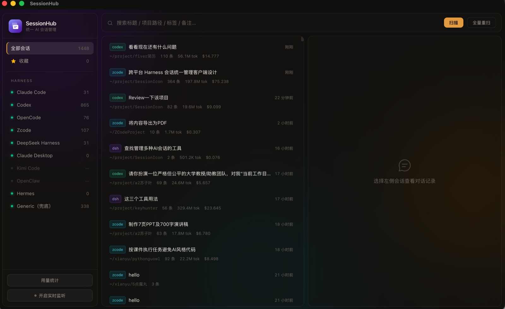
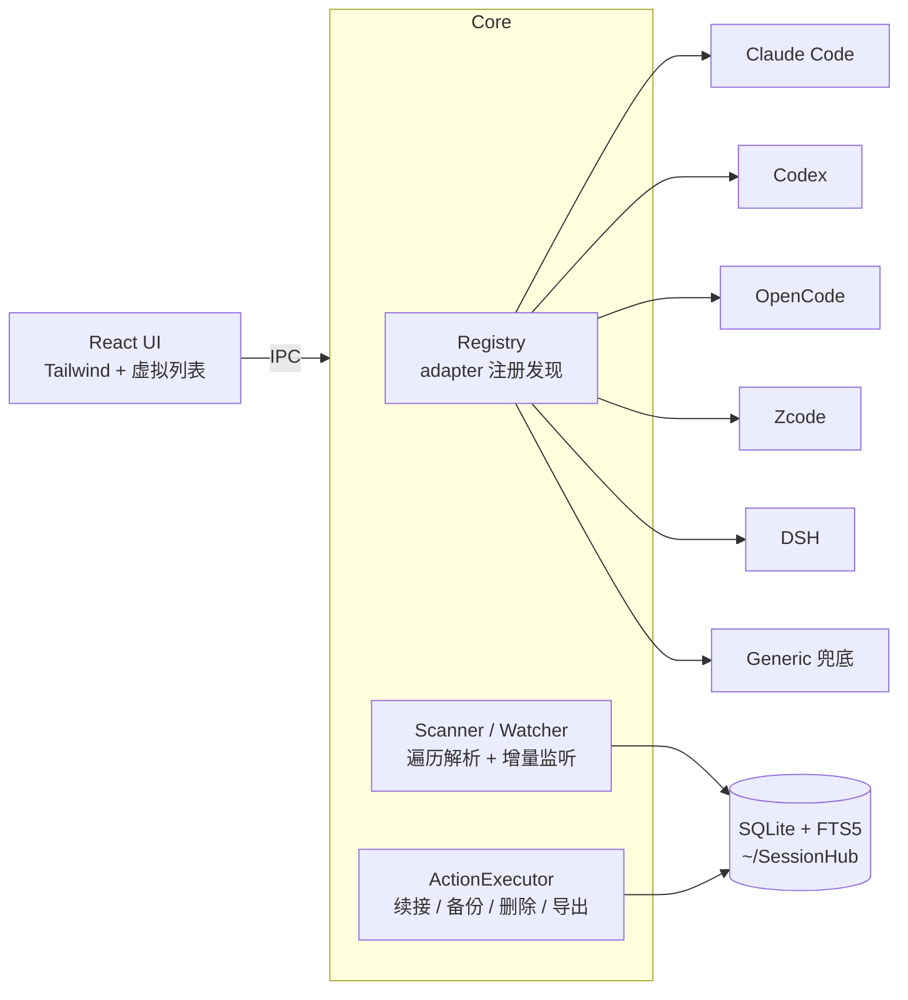

<div align="center">


<br/>

<a href="https://git.io/typing-svg"></a>

<br/>

[](https://github.com/NightsReimu/SessionHub/actions)
[](https://github.com/NightsReimu/SessionHub/tags)


<br/>



</div>

<br/>

把所有 AI 编程 harness 的会话——Claude Code、Codex、OpenCode、Zcode、DeepSeek Harness——**统一发现 → 浏览 → 搜索 → 续接 → 迁移 → 备份 / 清理**。本地优先，只读默认，跨平台原生窗口，玻璃拟态 UI + 彩色鼠标轨迹。

## 特性

<table>
<tr>
<td width="33%">

**统一发现**
Adapter 插件架构，每个 harness 一个适配器，新增不改核心

</td>
<td width="33%">

**全文搜索**
SQLite FTS5，不可用时自动降级 LIKE，标题/路径/标签/备注全覆盖

</td>
<td width="33%">

**一键续接**
`claude --resume` / `codex resume` / `opencode --continue`，跨平台拉起终端

</td>
</tr>
<tr>
<td>

**只读优先**
删除一律走系统回收站；标签/备注/收藏只写自己的数据库

</td>
<td>

**用量统计**
按模型刊例价估算费用（ccusage 口径），按 harness 聚合 token 与 Top 会话

</td>
<td>

**实时监听**
notify 监听各 harness 根目录，去抖增量重扫，扫描进度实时可见

</td>
</tr>
<tr>
<td>

**对话内嵌预览**
点开会话直接看完整对话，轻量 Markdown 渲染，气泡式排版

</td>
<td>

**备份导出**
文件复制 / 目录打 zip / 导出 Markdown / JSONL

</td>
<td>

**会话迁移**
把会话转换为目标 harness 的原生格式，直接在 Claude Code / Codex 里 resume 续接

</td>
</tr>
</table>

## 架构



加新 harness = 在 `src-tauri/src/adapters/` 实现一个 `HarnessAdapter` trait + 注册一行。
开发指南与安全契约见 [docs/ADAPTERS.md](docs/ADAPTERS.md)。

## 五条原则

1. **Read-only by default** —— 只读；删除走回收站，绝不硬删
2. **Adapter 化** —— 每 harness 一个 adapter，新增不改核心
3. **本地优先** —— 索引存本地 SQLite，不联网
4. **防御式解析** —— 格式无文档且会变，单行失败只跳过不崩溃
5. **流式读大文件** —— 几百 MB 的 JSONL / zstd 逐行流式解析

<details>
<summary><b>支持的 Harness 与存储格式</b>（macOS 实测路径）</summary>

<br/>

| Harness | 存储位置 | 格式 | 状态 |
|---|---|---|---|
| Claude Code | `~/.claude/projects/<编码项目>/<id>.jsonl` + `sessions-index.json` | JSONL | 完整支持 |
| Codex | `~/.codex/sessions/<年>/<月>/<日>/rollout-*.jsonl` + `archived_sessions/` | JSONL | 完整支持 |
| OpenCode | `~/.local/share/opencode/opencode.db`（只读打开） | SQLite | 完整支持 |
| Zcode | `~/.zcode/cli/db/db.sqlite`（用量聚合自 `model_usage`） | SQLite | 完整支持 |
| DeepSeek Harness | `~/.dsh/storages/session_projcache.json` + `session.jsonl.zstd` | JSON + zstd | 完整支持 |
| Claude Desktop / Kimi / OpenClaw / Hermes | 占位探测 + Generic 兜底 | 待确认 | 占位 |

> SQLite 型 harness（OpenCode/Zcode）的会话存在共享数据库里，因此**不支持删除和备份单会话**；导出 Markdown/JSONL 不受影响。
>
> 费用为刊例估算：Claude 按行内模型分档（Opus/Sonnet/Haiku，缓存读写单独计桶）、Codex 按 GPT-5 系（缓存输入折扣价）、DSH 按 DeepSeek 刊例、Zcode 按模型族近似价；OpenCode 为真实费用。

</details>

<details>
<summary><b>配置插件：免重编译扩展扫描目录</b></summary>

<br/>

编辑 `~/SessionHub/adapters.json`：

```json
{
  "generic_extra_roots": ["~/Library/Application Support/SomeApp/sessions", "/abs/path"]
}
```

GenericAdapter 会对这些目录做启发式解析（`.jsonl` / `.json`，自动找 cwd/title/时间戳，ID 按路径命名空间保证唯一）。

</details>

## 快速开始

```bash
# 开发模式（热更新）
npm install
npm run tauri dev

# macOS 本地构建（跳过容易超时的 dmg 步骤，只出 .app）
npx tauri build --bundles app
scripts/make-dmg.sh        # 可选：手动打 .dmg

# Windows：直接 npx tauri build（.msi / .exe）
```

## 测试与门禁

```bash
cd src-tauri
cargo test                                             # 17 个单元回归测试
cargo clippy --all-targets -- -D warnings              # lint 门禁
cargo fmt --check                                      # 格式门禁
cargo test scan_real_machine_smoke -- --ignored --nocapture   # 本机真实数据只读冒烟
```

## 发布

`.github/workflows/release.yml`：推 `v*` tag 即在 macOS（Apple Silicon + Intel）和 Windows 三个 runner 并行构建，自动创建 Draft Release 上传 `.dmg` / `.msi` / `.exe`：

```bash
git tag v0.1.1 && git push origin v0.1.1
```

> macOS 未签名应用需在「系统设置 → 隐私与安全性」放行；Windows 无证书会触发 SmartScreen，点「仍要运行」。

## Roadmap

- [x] M0 脚手架（Tauri + React + IPC + SQLite）
- [x] M1 核心 3 adapter：Claude Code / Codex / OpenCode
- [x] M2 DSH / Zcode + 续接 + 备份导出
- [x] M3 占位探测 + 标签备注收藏 + 实时监听 + 扫描进度条
- [x] M4 配置插件（adapters.json）+ adapter 开发文档 + CI 打包发布
- [x] M5-lite 用量统计面板 + 刊例价费用估算
- [ ] M5（可选）跨设备同步、AI 生成标题（需联网，与「本地优先」权衡后再定）

<div align="center">


</div>
